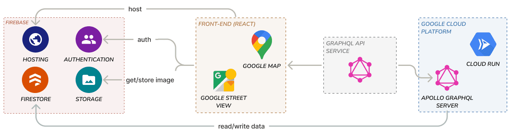

# Platform Architecture

<br/>
*(make by YU-CHENG WANG)*

# Overview
- In the directory `functions/`

## migration plan
- Update `firebase` and `firebase-admin` SDK. Since there are some changes in the import method, we man need more time to update the package.
  If it is possible, change the import method from CommonJS to ESM module.
- Update `apollo-server` from 2 to 3. But it seems that v3 doesn't support subscription natively. So we may need some time to investigate how to make subscription function normally.
## Installation
- First you need to install all the necessary packages. Run the following command in the directory `functions`:
  ```bash
  npm install
  ```

## Running, locally
- 在run之前，要先下載專案的 service accounts file，並設定環境變數`GOOGLE_APPLICATION_CREDENTIALS`。[參考這裡](https://firebase.google.com/docs/admin/setup#initialize-sdk)
- 設定好之後，切換到`[...]/SmartCampus/functions/graphql_server`底下，透過以下指令開啟
  ```bash
  npm run localstart
  ```
## Running in the docker
- Prequiste: You need to have `docker` + `docker-compose` to be installed. 
- In the directory, run the following command:
  ```
  docker compose up
  ``` 
- We don't push the image to Dockerhub, so the image would be built locally.
- The firestore emulator data would be store in the directory `./emulator-data` when you exit. And it would be import to the firestore emulator when you start the container next time. If you want to empty the firestore emulator, just delete the content in the directory.
  - You must have `./emulator-data` directory before set up container, or the container would crash.
- If you want to test the auth functionality, you can see [here](https://firebase.google.com/docs/emulator-suite/connect_auth). The port(9099) already be exposed. Make sure you connect to the auth service using `0.0.0.0:9099` rather than `localhost:9099`
- **Connect to the service by `0.0.0.0:<port>` rather than `localhost:<port>`**(It depends on Windows or Mac)

## Deployment
- 在最一開始想先安裝firebase-tools和initialize，參考[get started](https://firebase.google.com/docs/functions/get-started) step 2 and 3
- 完成更動後，跑下面的指定把更動部署到cloud function上
  ```bash
  firebase deploy --only functions
  ```

## Tools
- Programming language: node.js v14
- API framework: Apollo graphql server
- Database: firebase firestore + firebase Admin SDK
- Deploy on: GCP cloud run

## reference

### Apollo graphql server

- [Apollo graphql tutorial](https://www.apollographql.com/docs/tutorial/introduction/)
- [GraphQL Server Tutorial with Apollo Server and Express](https://www.robinwieruch.de/graphql-apollo-server-tutorial)

### firebase
- [official documentation](https://firebase.google.com/docs)

# Document
- [firestore fields description](docs/firestoreFields.md)
- [naming convention](docs/names.md)