# firestore fields description

- [firestore data type](https://firebase.google.com/docs/firestore/manage-data/data-types#data_types)

## tagData: collection
- There may be different `tagData` collection with different postfix. This is because we
  want to store the data in different time period for class service learning.

```mermaid
erDiagram
    tagData ||--|{ status : subcollection
    tagData ||--|| StreetViewInfo : Map
    tagData ||--|| Category : Map

    tagData {
        String locationName
        Category category
        Integer floor
        GeoPoint coordinates
        String geohash
        Timestamp createTime
        Timestamp lastUpdateTIme
        String createUserId
        Boolean archived
        StreetViewInfo streetViewInfo
        Integer viewCount
    }

    StreetViewInfo {
        Float cameraLatitude
        Float cameraLongitude
        String panoID
        Float povHeading
        Float povPitch
    }

    Category {
        String missionName
        String subTypeName
        String targetName
    }

    status {
        Timestamp createTime
        String createUserId
        String description
        Integer numberOfUpVote
        String statusName
    }
```

## userActivity: collection

## userStatus: collection
